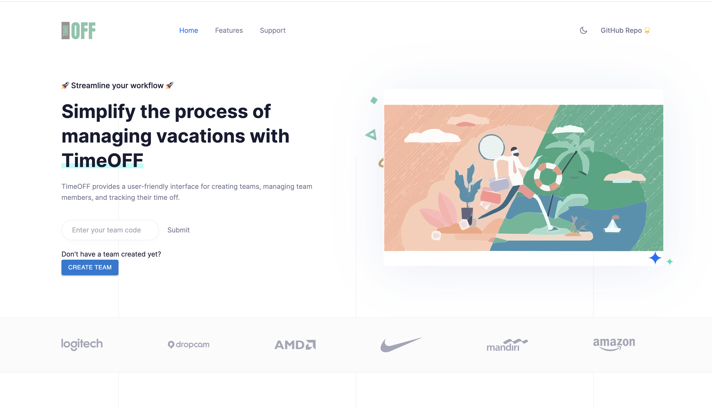
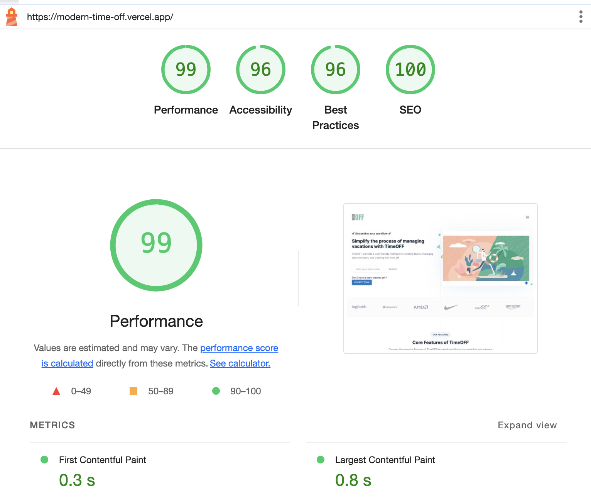
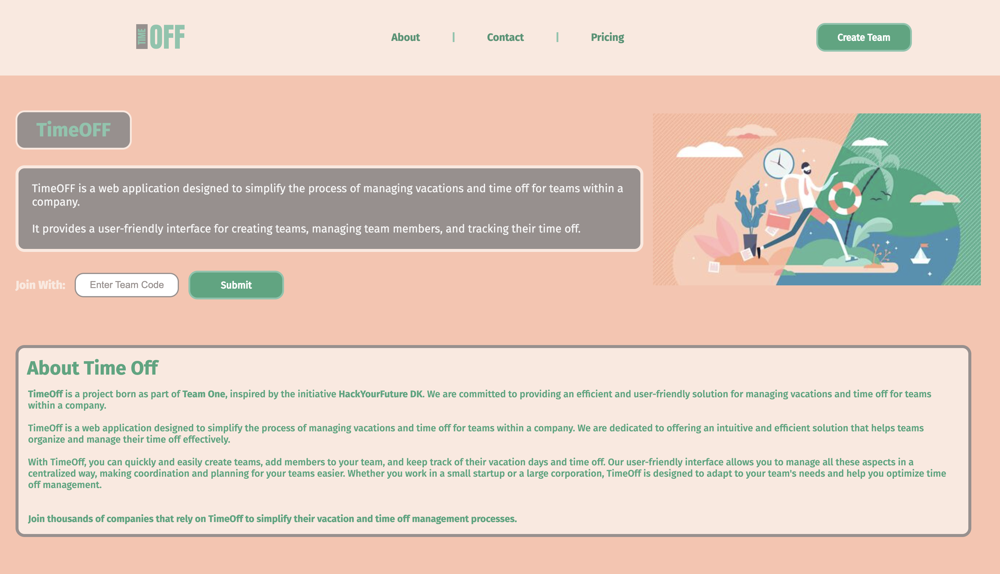

# TimeOff App - Modern Version

TimeOFF provides a user-friendly interface for creating teams, managing team members, and tracking their time off.

## Project Versions


### Current Version


### Lighthouse Report


### Previous Version


## Table of Contents

- [Installation](#installation)
- [Stack](#stack)
- [Usage](#usage)
- [Contributing](#contributing)
- [License](#license)
- [Contact](#contact)

## Installation

Follow these steps to install and set up the project on your local environment:

```bash
# Clone the repository
git clone https://github.com/nicoquiroga90/Modern_TimeOff.git

# Navigate to the project directory
cd Modern_TimeOff

# Install dependencies
npm install

# Update the API path
# In the utils folder, modify the api.js file to use the local host path (it is commented in the file)

# Run the app
npm run dev


## Stack

The project was migrated from React to Next.js. The database used is Neon (PostgreSQL) and the styles are a combination of CSS and Tailwind.

## Usage

### Create Team

From the homepage, use the "Create Team" button. You will be required to enter a name, then you will receive a message including the code for your new team: save it to access your team anytime!

### Dashboard

- **Create Member:** Use the "Create Member" button to create a new member, choose their color to represent them in the calendar, and set the number of allowed free days.
- **Delete Member:** Delete any of the created members as well as the previously loaded free days in the calendar.
- **Create Time Off:** Select the member who will take the day off and choose the date and details for the day off. Once accepted, it will be displayed on the calendar.
- **Delete Time Off:** By clicking on the event within the calendar, you can see the event details and have the option to delete it.

### Other Features

- **Contact:** From the homepage or the Support section, you can send a message to the creator (me ^^) and I will be happy to respond!

## Contributing

The project is open to contributions. If you wish to contribute, fork the repository and open a Pull Request (PR).

## License

This project is licensed under the MIT License. See the [LICENSE](LICENSE) file for more details.

## Contact

You can contact me via email at nicoq1290@gmail.com or leave a message through the Support/Contact section of the website.
